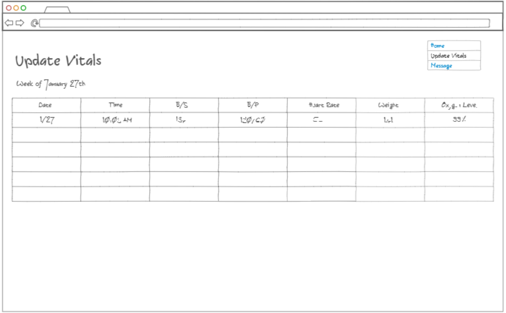

# Caregiver Tool

I am currently working as an at-home caregiver for an elderly family member. Caregiver Tool, my startup application, would allow at-home caregivers like me to record their patients' vitals, track their health over time using graphs, and message other caregivers/healthcare providers. The main page displays the patient's current vitals and historical graphs, and these statistics can be updated and recorded in the spreadsheet page. When issues arise, a doctor, at-home nurse, or fellow caregiver can be messaged and notified. 
### Home Page

### Update Vitals Page

### Message Page

Key features:
* Track patient vitals, including heart rate, B/S, B/P, oxygen level
* Display graphs of historical data
* Pain level tracker
* To-do list for patient
* Record vitals on spreadsheets that update main page in real-time
* Message healthcare providers and other caregivers

Notes about console assignment: 
This was a great experience. I learned a ton about repositories and cloning them to my computer. I learned how to push and pull changes. I learned how to edit my files using the console and GitHub. 
Steps to remember: git pull, git add ., git commit -m "(insert message)", git push
Also: check what directory with cmd and change directory with cd

Notes on Simon HTML project:
This project was a lot of fun and solidified my understanding with HTML structure, content, and layout. I had fun experimenting with different HTML elements. I also became a lot more comfortable with pushing my local development edits to my repository and constantly checking to make sure my progress was saved. I want to remember the console command: ./deployFiles.sh -k /keys/mykey.pem -h mydomain.click -s simon to deploy to my production environment. Head to simon.brysonon.com to check it out!

Notes on Simon CSS project:
Being able to finally stylize the website and customize it to my liking was very entertaining and fulfilling. I became much more comfortable with the use of CSS and its Bootstrap framework, and I learned a lot about flex containers and how to make your site responsive. You can set a container's display to flex (display: flex) and change the alignment of its child elements with flex-direction: column or row. Bootstrap can be used to simplify the process of making your site responsive and provides great formatting for buttons and texts.

Notes on startup application - HTML and CSS version:
I learned so much more about HTML and CSS through this project. I figured out just how helpful Bootstrap can be, as it heavily simplifies the coding that you need to do. With a little bit of documentation reading and CSS knowledge, you can easily create a site out of your ideas. I want to remember the link https://getbootstrap.com/docs/5.3/getting-started/introduction/ which provides all of the Bootstrap documentation. 

Notes on Simon JavaScript project:
Implementing JavaScript into the simon project has been my favorite implementation so far. This is because it has made the application fully operational, and the game can now be played. The most useful feature of the application that I learned was the use of localStorage to instantiate Storage objects to store user information, such as the name and scores. I also learned that the querySelector() function could be used to select specific elements within HTML. This link: https://developer.mozilla.org/en-US/docs/Web/API is very useful because it details JavaScript that can be utilized for a variety of web APIs. 